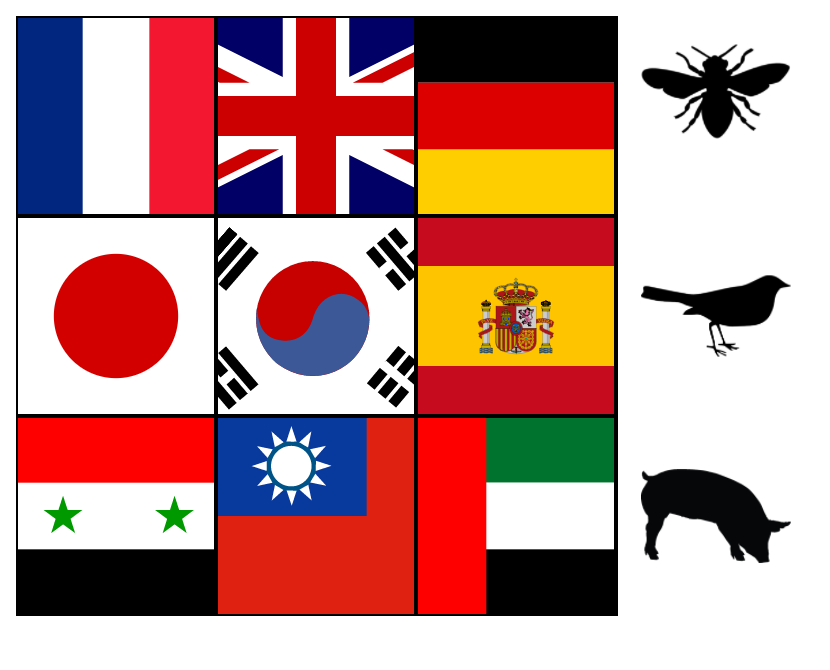
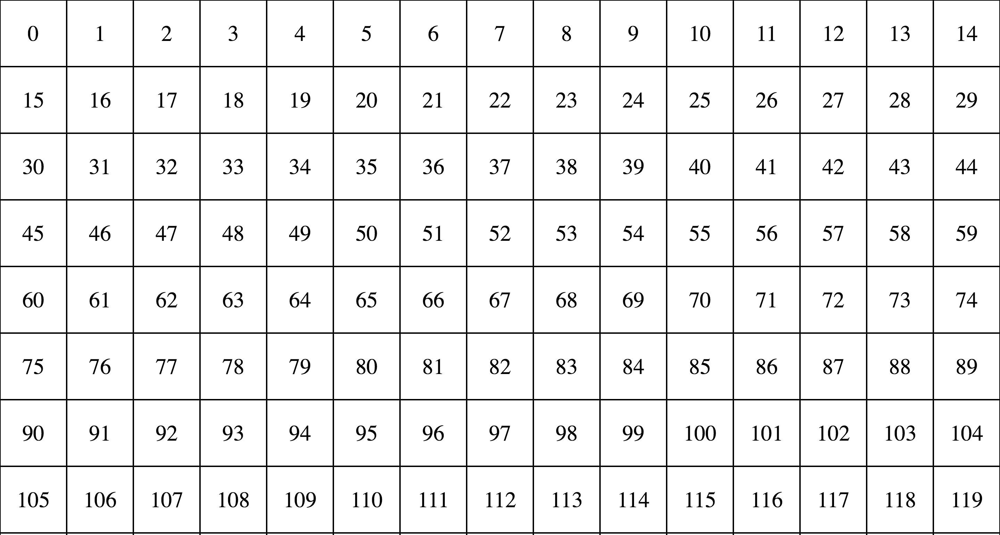
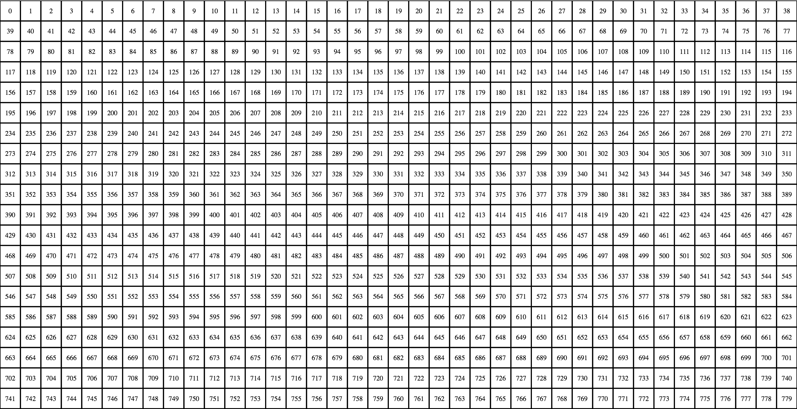
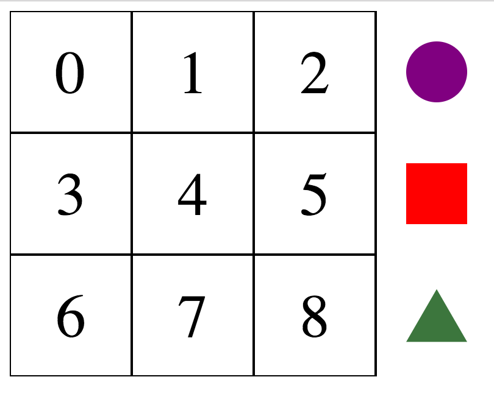
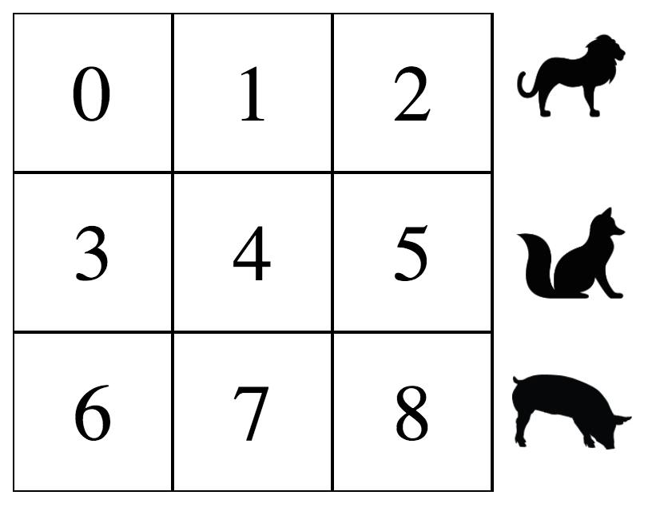

# web-demo-boardgame

<h1>Interactive Boardgame of Animal Sounds in Different Languages</h1>

This repository highlights the prototyping of a simple boardgame idea: discovering animal sounds in different languages. My girlfriend and I have been brainstorming a boardgame around this premise for a number of years, so I decided to first develop a web-based demo as a proof-of-concept.

The following links were inspirations for this idea...
<ul>
<li><a href="http://www.eleceng.adelaide.edu.au/personal/dabbott/animal.html">http://www.eleceng.adelaide.edu.au/personal/dabbott/animal.html</a></li>
<li><a href="https://www.esl-languages.com/en/study-abroad/coffee-time/animal-sounds/index.htm">https://www.esl-languages.com/en/study-abroad/coffee-time/animal-sounds/index.htm</a></li>
<li><a href="http://www.boredpanda.com/animal-sounds-different-languages-james-chapman/">http://www.boredpanda.com/animal-sounds-different-languages-james-chapman/</a></li>
</ul>

In brainstorming a physical boardgame (still in the works), I found it difficult to explain the concept to people so I decided to make a simplified web-based demo to highlight the concepts. This demo consists of four parts...

<ol>
<li>Generate a boardgame grid >>> <code>boardgame-GenerateGrid.html</code></li>
<li>Drag-and-drop objects (game pieces) onto the grid >>> <code>boardgame-SimpleShapes.html</code></li>
<li>Use animal shapes for game pieces >>> <code>boardgame-SimpleAnimals.html</code></li>
<li>Add country flags and animal sounds >>> <code>boardgame-AnimalSoundsFlags.html</code></li>
</ol>

<h1>1. Generate a Boardgame Grid</h1>

The first step was to make an SVG-based boardgame grid generator using D3. A random number of grid boxes (0-3000) are generated to fill up the window width. On each page refresh, a new grid is generated. 

Sample Grids

The envisioned boardgame would have a static number of grid boxes, but the concept of a dynamically generated grid was interesting and explored out of curiousity. 

<h1>2. Drag-and-drop Objects (Game Pieces) onto the Grid</h1>

Taking the concept of a grid generator, a static "game board" grid of 9 boxes was created. Then, a side panel of 3 shape "pieces" was added. The shapes were given interactive 'draggable' features using the <a href="http://interactjs.io/">interact.js</a> library and allowed to be dragged onto the game board. Then, a simple text output highlighting what piece(s) are on what grid box was included. This "what-piece-in-what-space" identification is crucial for future functionality of the board game concept.

<h1>3. Use Animal Shapes for Game Pieces</h1>

Next, the SimpleShapes demo was extended to replace the simple shapes with PNG images of animal silhouettes. This extra step is somewhat complicated due to using SVG shapes, specifically the need to use pattern definitions in order to set images as backgrounds of SVG shapes.

<h1>4. Add Country Flags and Animal Sounds</h1>

Finally, the AnimalShapes demo was extended to include (i) country flags instead of numbers identifying each grid box and (ii) triggered audio of the various animal/language combinations. 

In order to generate a set of different animal/language sounds, the MP3 files from the ESL-Language Animal Sounds webpage were downloaded via a custom Python script, <code>python/downloadAnimalSounds.py</code> (The full set of these MP3 files can be found in the <code>python/downloads</code> folder).

Country flags corresponding to the available animals/languages (e.g. Belgian, German, Syrian, etc) were then added to the grid box background images uses SVG flag icons from <a href="https://github.com/lipis/flag-icon-css">https://github.com/lipis/flag-icon-css</a>.

Using the "what-piece-in-what-space" functionality from before, it was then easy to play the MP3 of the animal/language combination when an animal piece is placed in a flag box (using <a href="https://howlerjs.com/">howler.js</a>). <i>NOTE: Playing MP3 files using howler.js will trigger CORS errors if the web demo is being viewed locally, however howler.js will fall back on HTML audio to play anyway; to avoid CORS issues, simply run the web demo on a local server via Python or other method.</i>

